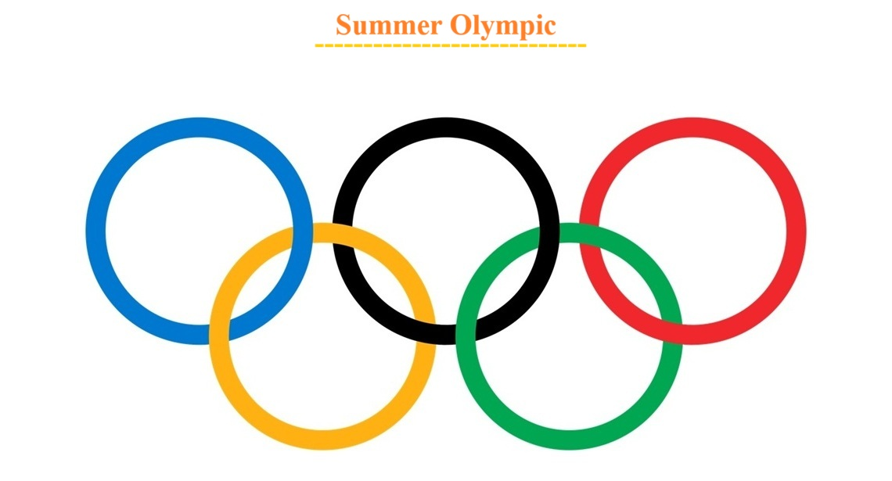

# 💡 Python Project by Yash Yennewar

# 🏅 Summer Olympics Medals Analysis (1896--2008)
An exploratory data analysis of Summer Olympic medals (1896–2008) revealing trends in country dominance, sport specialization, athlete success, and gender participation using Python.

## 🔗 Project Link

[Summer_Olympic_Medalists_Analysis](Summer_Olympic_Analysis.ipynb)

---

## 📌 Project Overview

This project performs an **Exploratory Data Analysis (EDA)** on the **Summer Olympic Medallists dataset (1896--2008)** to uncover historical trends, country dominance, sport specialization, athlete achievements,
and gender participation using **Python data analysis libraries**.

---

## 🎯 Objectives

-   Analyze medal distribution across Olympic editions
-   Identify top-performing countries and sports
-   Study athlete-level achievements
-   Explore gender participation trends over time
-   Evaluate medal quality using weighted scoring

---

## 📊 Dataset Information

-   **Source:** Summer Olympic Medallists (1896--2008)
-   **Key Columns:**
    -   Edition -- Olympic year\
    -   City -- Host city\
    -   Sport -- Sport category\
    -   Discipline -- Discipline within sport\
    -   Athlete -- Athlete name\
    -   Gender -- Male/Female\
    -   NOC -- Country code\
    -   Medal -- Gold / Silver / Bronze

---

## 🧠 Analysis Performed

-   Overall Olympic medal trends
-   Country-wise medal performance
-   Sport and discipline dominance
-   Most decorated athletes
-   Gender participation growth
-   Medal efficiency using weighted scores

---

## 🛠️ Tools & Technologies

-   Python
-   Pandas
-   NumPy
-   Matplotlib
-   Seaborn
-   Jupyter Notebook

---

## 📈 Key Insights

-   Medal counts increased significantly after 1950
-   USA, USSR, and Germany dominate historically
-   Athletics and Swimming contribute the highest medals
-   Female participation has grown steadily since the 1970s
-   Some countries excel in medal quality over quantity

---

## 📁 Project Structure

    ├── Summer_Olympic_Medals_Analysis.ipynb
    ├── Summer_Olympic_medallists_1896-2008.xlsx
    ├── README.md

---

## 🚀 How to Run

1.  Clone the repository
2.  Open the Jupyter Notebook
3.  Run all cells to reproduce the analysis

---

## 💡 Final Insights :
1. Medal counts increased significantly after 1950 due to more events.
2. USA, USSR, and GER dominate Olympic history.
3. Athletics and Swimming contribute the most medals.
4. Female participation has grown consistently since the 1970s.
5. Some countries perform better in medal quality (gold-heavy) than quantity.

---

## ✅ Conclusion :
This analysis explores historical Olympic medal trends, country dominance,sport specialization, and gender inclusion from 1896 to 2008.
The project demonstrates strong EDA, visualization, and storytelling using Python, Pandas, Matplotlib, and Seaborn.
